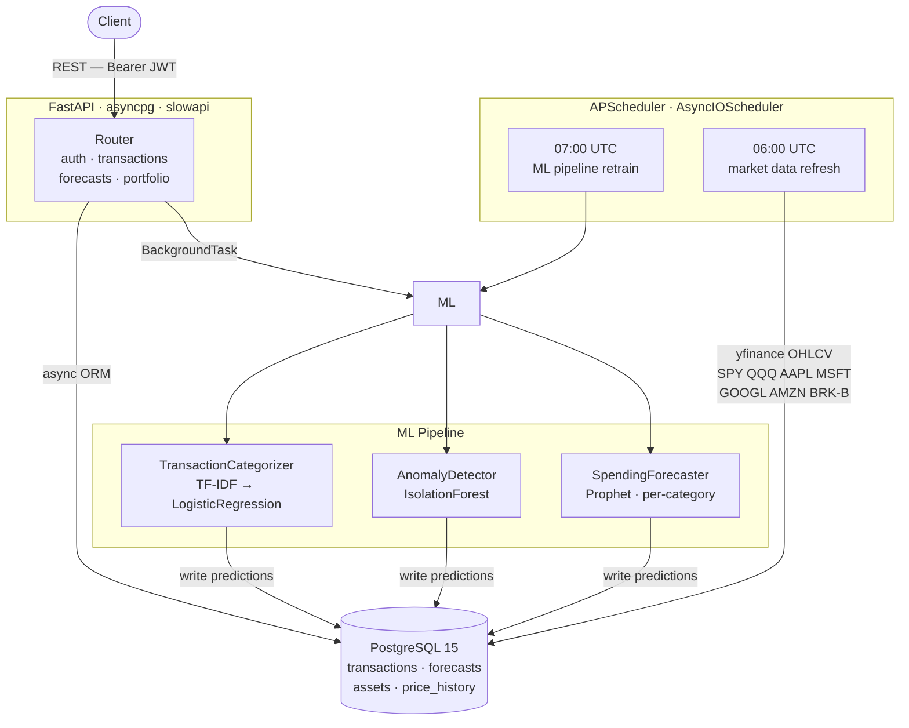

# financial-intelligence-platform

A production-grade REST API demonstrating async Python service architecture with an integrated ML inference layer: async SQLAlchemy 2.0 over asyncpg, three independently-trainable scikit-learn / Prophet models served behind FastAPI, and a background scheduler that keeps market data and model state current without blocking the request loop. The stack is fully containerized with a multi-stage Docker build, schema migrations on container start via Alembic, and a GitHub Actions pipeline that enforces linting, 70 % coverage, and pushes a signed image to GHCR on every merge to `main`.

---

## Architecture



---

## Tech Stack

| Category | Technology | Why |
|---|---|---|
| API framework | FastAPI 0.115 | Native `async`/`await`, automatic OpenAPI + Pydantic v2 validation, dependency injection |
| ASGI server | Uvicorn + httptools | Lowest-overhead ASGI server; `uvloop` event loop via `[standard]` extra |
| Database | PostgreSQL 15 | Reliable ACID, `NUMERIC` for financial precision, partial indexes on `is_anomaly` |
| ORM / sessions | SQLAlchemy 2.0 async | Fully non-blocking with `asyncpg`; typed query API; `AsyncSession` pools per process |
| Schema migrations | Alembic | First-class SQLAlchemy integration; forward/rollback migrations run at container startup |
| Anomaly detection | scikit-learn `IsolationForest` | Unsupervised — no labeled anomaly corpus needed; O(n log n); `contamination` is the only tunable |
| Time-series forecasting | Prophet (Meta) | Automatic weekly + yearly seasonality decomposition; robust to missing dates; 95 % confidence bands out of the box |
| Transaction categorization | TF-IDF + `LogisticRegression` | Sub-millisecond inference after training; `class_weight="balanced"` handles rare categories without oversampling |
| Authentication | python-jose + passlib/bcrypt | HS256 JWT for stateless auth; bcrypt with work factor for password storage |
| Rate limiting | slowapi | Starlette-native middleware; per-IP limiting via `X-Forwarded-For` |
| Structured logging | structlog | JSON in production, colored console in dev; zero-config `contextvars` request tracing |
| Scheduling | APScheduler `AsyncIOScheduler` | Cron-based, non-blocking; `coalesce=True` + `misfire_grace_time` for missed-fire safety |
| Containerization | Docker multi-stage | Builder compiles native extensions; runtime image has no compilers; runs as `appuser` |
| CI/CD | GitHub Actions + GHCR | `workflow_call` reuse between CI and deploy; GHA BuildKit cache eliminates redundant layer builds |

---

## Quick Start

**Prerequisites:** Docker ≥ 24, Docker Compose v2, Git.

```bash
git clone https://github.com/aadhyanagar08/financial-intelligence-platform.git
cd financial-intelligence-platform

# 1. Configure environment
cp .env.example .env
#    Edit .env and set a real SECRET_KEY:
#    python -c "import secrets; print(secrets.token_hex(32))"

# 2. Start Postgres + backend (migrations run automatically on first start)
docker compose up --build

# 3. Verify
curl http://localhost:8000/health
```

The API is live at **`http://localhost:8000`**.  
Interactive docs (Swagger UI) at **[http://localhost:8000/docs](http://localhost:8000/docs)** — disabled when `ENVIRONMENT=prod`.

---

## API Reference

Full schema and try-it-out UI at `/docs` (Swagger) or `/redoc` (ReDoc) when running in `dev` or `staging`.

### Auth — `/api/v1/auth`

| Method | Path | Description |
|---|---|---|
| `POST` | `/register` | Create account; returns `UserOut` |
| `POST` | `/token` | OAuth2 password flow; returns `Bearer` token |
| `GET` | `/me` | Current authenticated user |

All non-auth endpoints require `Authorization: Bearer <token>`.

### Transactions — `/api/v1/transactions`

| Method | Path | Description |
|---|---|---|
| `GET` | `/` | Paginated list; filters: `date_from`, `date_to`, `category`, `is_anomaly` |
| `POST` | `/` | Create; triggers background auto-categorization if `category` is omitted |
| `GET` | `/summary` | Total income, expenses, net savings, savings rate for a date range |
| `GET` | `/anomalies` | Flagged transactions only; same pagination + date filters |

### Forecasts — `/api/v1/forecasts`

| Method | Path | Description |
|---|---|---|
| `GET` | `/summary` | Next-30-day projected spend by category |
| `GET` | `/{category}` | 90-day forecast with `yhat_lower` / `yhat_upper` confidence bands |
| `POST` | `/refresh` | `202 Accepted`; retrains Prophet models as a background task |

### Portfolio — `/api/v1/portfolio`

| Method | Path | Description |
|---|---|---|
| `GET` | `/` | Holdings with live prices from yfinance |
| `GET` | `/history` | OHLCV price history; `?days=N` param |
| `GET` | `/metrics` | Total value, daily change, 30-day return, annualised volatility, Sharpe ratio |

---

## Testing

Tests use **pytest-asyncio** with `asyncio_mode = "auto"` and an in-memory **SQLite** database (via `aiosqlite` + `StaticPool`) so no running Postgres is required.

```bash
# Install dev dependencies
pip install -e ".[dev]"

# Run full suite with coverage (threshold: 70 %)
pytest

# Coverage report as HTML
pytest --cov-report=html
open htmlcov/index.html
```

### Test layout

```
tests/
├── conftest.py              # app_client fixture (SQLite + StaticPool), auth helpers
├── unit/
│   ├── test_anomaly.py      # IsolationForest: train/predict, outlier detection, score ordering
│   ├── test_forecast.py     # Prophet: column schema, period counts, confidence-band invariants
│   └── test_validate.py     # DataQualityChecker: all three checks, chaining, report structure
└── integration/
    ├── test_auth.py         # Register, login, JWT validation, expired-token rejection
    ├── test_transactions.py # Full CRUD, pagination, all four filters, summary math, anomaly writes
    ├── test_forecasts.py    # Summary aggregation, 404 on missing category, refresh 202
    └── test_portfolio.py    # yfinance mock, empty-asset early returns, metrics schema
```

Coverage is enforced by `--cov-fail-under=70` in `pyproject.toml`; CI fails if the threshold is not met.

---

## CI/CD

Two GitHub Actions workflows:

### `ci.yml` — triggered on every push and pull request

```
lint ──────────────────────────┐
  ruff check .                 ├──► test ──► upload coverage artifact
  ruff format --check .        │
                               └──► build (docker build --no-push)
```

- **lint**: `ruff check` + `ruff format --check` — zero tolerance.
- **test** (`needs: lint`): spins up a `postgres:15-alpine` service container, caches `~/.cmdstan` by `pyproject.toml` hash, runs `pytest --cov-report=xml`, uploads `coverage.xml`.
- **build** (`needs: lint`, parallel with test): `docker/build-push-action` with `push: false`; uses the GHA BuildKit layer cache so the cmdstan download is not repeated across runs.

### `deploy.yml` — triggered on push to `main` only

```
ci (workflow_call — all three jobs) ──► push-image to ghcr.io
```

Calls `ci.yml` via `workflow_call` before the push step, so the deploy job never runs on a commit that fails linting, testing, or the Docker build. Images are tagged `sha-<short>` (immutable) and `latest` (rolling). The `GITHUB_TOKEN` is scoped to `packages: write` only in the push job.

---

## Key Engineering Decisions

### 1. Async SQLAlchemy (asyncpg) over sync psycopg2

FastAPI runs on a single-threaded event loop. A sync DB driver blocks the loop for the duration of every query — under moderate concurrency that collapses throughput to effectively one query at a time. `asyncpg` returns control to the event loop during network I/O, so hundreds of in-flight requests share the same thread without thread-pool overhead.

The cost: Alembic has no async driver support, so `alembic.ini` and `env.py` use a `sync_database_url` property that substitutes `psycopg2` at migration time. Two driver packages ship in the image. This is the accepted trade-off in the SQLAlchemy ecosystem.

### 2. Prophet over ARIMA for spend forecasting

ARIMA requires the time series to be stationary, manual selection of (p, d, q) hyperparameters per category, and breaks on missing dates (a weekend with no Food spend is structurally a gap, not a zero). That means a separate preprocessing and hyperparameter search step for each of N categories.

Prophet treats trend, weekly seasonality, and yearly seasonality as additive components and fits them jointly. It handles irregularly-spaced dates natively, produces calibrated 95 % confidence intervals via its Stan backend, and requires no per-category tuning. The trade-off is a ~200 MB CmdStan binary in the Docker image and a longer cold-start on first model load. For a forecasting use case that runs once per day in a background job, this is an acceptable runtime cost.

### 3. Stateless JWT over server-side sessions

Server-side sessions require a shared store (Redis, DB table) that every backend instance can read. Without it, a sticky load balancer is mandatory — any pod restart invalidates all active sessions. JWT validation is a local operation: verify the signature with the secret key, check `exp`, done. Any replica can validate any token with zero inter-process communication.

The practical consequence: token revocation requires an out-of-band denylist (not yet implemented). For this API — short-lived tokens (configurable via `ACCESS_TOKEN_EXPIRE_MINUTES`) and no admin-revocation requirement — the simplicity of stateless validation outweighs the revocation limitation.

### 4. IsolationForest for unsupervised anomaly detection

Supervised anomaly detection needs labeled examples of anomalous transactions. In practice these don't exist at system bootstrap, and accumulating them is slow. IsolationForest requires no labels: it isolates points that are easy to separate from the bulk of the distribution, using random partitioning trees with O(n log n) complexity and a small memory footprint.

The model uses three features — `amount`, `day_of_week`, and `category` (label-encoded) — which capture the most common anomaly patterns (unexpected large charge, weekend corporate transaction, wrong merchant category). The `contamination=0.05` default flags roughly 5 % of transactions; this is configurable at train time. The main limitation is that the threshold is global: a category with inherently high variance (e.g. Housing) will have fewer anomalies flagged than a low-variance category at the same contamination rate. A per-category contamination parameter is a natural next step.
